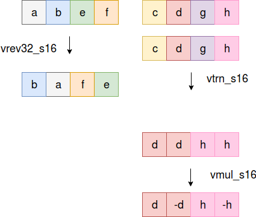

[algorithm.c](algorithm.c) contains the code to perform complex multiplication between two vectors of complex numbers using Arm NEON SIMD. Each array stores the complex numbers as real part followed by imaginary part. The algorithm takes as input two int16x8_t with interleaved real and imaginary part and repeats twice the following scheme:

|[img2](Complex_mul2.png)
